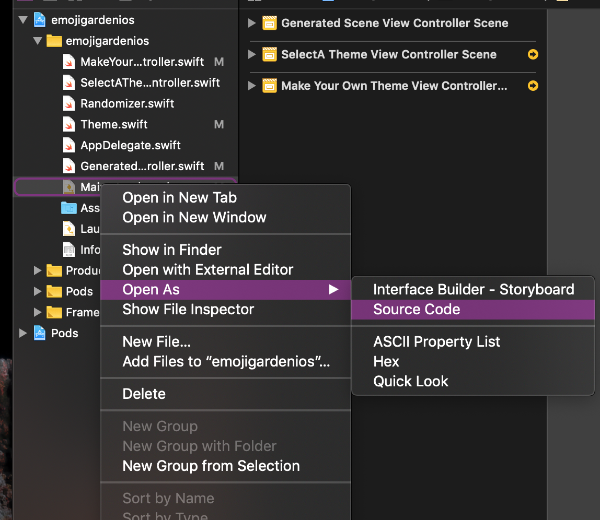

# Storyboard XML 

---

> Here be dragons 
-- Ellen, not a medieval cartographer  


^ So I asked one my coworkers, and another former apprentice, yesterday what I should tell you all about storyboard XML and this is what she said. 

--- 


^ And that get kind of to why I wanted to talk to you all about it in the first place. Because storyboard XML scared the bejesus out of me earlier in my career, and in some ways, it still kind of does. 


--- 


^ But if it's a dragon, or if it houses dragons, then they are dragons that you can tame and make your friend. 

---


^ Maybe they won't ever be lap dragons, but they can be dragons that you know and maybe gave names to and don't run screaming from on sight. Maybe this metaphor is getting away from me. 

--- 

# What is XML? 

--- 


^ Here's some xml from the main storyboard of a hack project I've been working on. Hopefully, you can already see one thing that can help you tame the XML dragon, namely that this stuff looks a LOT like HTML. 

---

# What is XML? 

- eXtensible Markup Language 
- looks like HTML (this is on purpose) 
- designed to store and transport data 
- no pre-defined tags 

^ So what is it, if not a series of possibly friendly dragons? It stands for extensible markup language, and like I said before, it looks a lot like HTML on purpose. Unlike HTML, though, it does not have pre-defined tags--nothing like "div" or "button" or whatever that's universally understood. It uses it's own self-defined tags to store and transport data. 

--- 

# XML doesn't DO anything 

^ But it doesn't actually DO anything, and that's key. It just wraps this data in a way that someone or something else, can parse and do something with. 

--- 

# 🔬

^ So let's put some storyboard XML under a microscope, and learn it's secrets. 

--- 


^ SO this looks real cryptic, and kind of overwhelming. If I had to fit all this in my head, I'd probably get dizzy and need to lie down. But let's zoom in to one small part of this business. 

--- 

```xml
<button opaque="NO" contentMode="scaleToFill" contentHorizontalAlignment="center" 
   contentVerticalAlignment="center" buttonType="roundedRect" lineBreakMode="middleTruncation"
   translatesAutoresizingMaskIntoConstraints="NO" id="Wic-rd-7CC">
   <rect key="frame" x="0.0" y="592" width="187.5" height="75"/>
   <color key="backgroundColor" red="0.62352941179999999" green="0.2470588235" 
      blue="0.38823529410000002" alpha="1" colorSpace="custom" customColorSpace="sRGB"/>
   <constraints>
      <constraint firstAttribute="height" constant="75" id="Pqg-6n-30e"/>
   </constraints>
   <fontDescription key="fontDescription" type="system" pointSize="23"/>
   <state key="normal" title="Share on twitter">
      <color key="titleColor" white="1" alpha="1" colorSpace="custom"
      customColorSpace="genericGamma22GrayColorSpace"/>
   </state>
   <connections>
      <action selector="shareOnTwitterButtonPressed" destination="BYZ-38-t0r" eventType="touchUpInside" 
         id="iGU-P3Zec"/>
   </connections>
</button>
```

^ This button, for instance. This is still kind of confusing, but you can already see some digestible parts we can break this into. We've got stuff like Line Break Mode, and color keys, and constraints, and...wait...where have we seen this? 

--- 

 

^ This storyboard XML is just a coded representation of the settings you create in interface builder. Each of these tags corresponds directly to one of these options you can set. 

--- 

```xml
<button opaque="NO" contentMode="scaleToFill" 
   contentHorizontalAlignment="center" 
   contentVerticalAlignment="center" 
   buttonType="roundedRect" lineBreakMode="middleTruncation"
   translatesAutoresizingMaskIntoConstraints="NO" id="Wic-rd-7CC">
  // stuff 
</button>
```

^ And, like HTML, it's a hierarchical representation. Within the opening and closing button tags are all the attributes and sub-views and constraints and whatnot of that button. First, you get the opening button, and some information about the button itself, including, at the end there, a unique id. Each element, every label and button and view controller and segue, all the bits, will have a unique id.  

--- 

```xml
<rect key="frame" x="0.0" y="592" width="187.5" height="75"/>
<color key="backgroundColor" red="0.62352941179999999" 
   green="0.2470588235" 
   blue="0.38823529410000002" alpha="1" 
   colorSpace="custom" customColorSpace="sRGB"/>
```

^ Then we've got some information on the composition of the button--where is it located, what size is it, and what color is it? 

--- 

```xml
<constraints>
   <constraint firstAttribute="height" constant="75" id="Pqg-6n-30e"/>
</constraints>
```

^ Then we get a list of constraints, and the constraint attributes and id's 

---

```xml
<state key="normal" title="Share on twitter">
   <color key="titleColor" white="1" alpha="1" colorSpace="custom"
     customColorSpace="genericGamma22GrayColorSpace"/>
</state>
```

^ Then we have some more information, including some clues, finally to exactly which button this is! 

---

```xml
<connections>
   <action selector="shareOnTwitterButtonPressed" 
      destination="BYZ-38-t0r" eventType="touchUpInside" 
      id="iGU-P3Zec"/>
</connections>
```

^ and finally, connections and actions that apply to the button. Including, as you can see, a unique ID for the action itself, and a reference to the ID of the destination of that selector. These IDs are super handy if you need to match things or figure out what buttons or labels connect to which view controller or something like that. And they are easily copy-able and past-able into a file search or something like that. 

---

```xml 
<!--Generated Scene View Controller-->
<scene sceneID="tne-QT-ifu">
   <objects>
      <viewController id="BYZ-38-t0r" customClass="GeneratedSceneViewController"
         customModule="emojigardenios" customModuleProvider="target" 
         sceneMemberID="viewController">
                     // stuff 
      </viewController>
   <placeholder placeholderIdentifier="IBFirstResponder" id="dkx-z0-nzr" 
      sceneMemberID="firstResponder"/>
   </objects>
   <point key="canvasLocation" x="136.80000000000001" y="69.715142428785612"/>
</scene>

```

^ Each view controller and all it's contained subviews and associated business are wrapped up in these handy tags that tell you what each View Controller is, and there's even a nice comment demarking each discreet view controller! That's very handy. If you are paying attention, you may have noticed that this view controller's ID matches the destination ID referenced in the button connections we just looked at. Also, make a note of the very HTML-like opening and closing tags. There's an opening for the scene, for objects, for the view controller, and matching closing tags for each of those. In a real storyboard XML, that part for "stuff" is going to be hundreds of lines long. Xcode will give you some indentation to help spot this in the wild. But just know that like HTML, these tags need to open AND close. It can happen inline, like with the placeholder up here, or it can be a matching close tag somewhere later. 

--- 

> That's great and all but Anne, I don't want to make friends with dragons. 
-- you, maybe 

^ So this is all great, but I'm sure some of you are wondering why, if we have Xcode and interface builder, we even need to bother with knowing what this particular dragon's guts look like. Fair question. 

--- 

> Life is hard; it's harder if you're stupid. 
-- John Wayne, maybe 

^ I was looking for a generic "life is hard" meme for you, and I came across this quote. I don't trust that it's real, but we'll go with it for now. Obviously, no knowledge is ever wasted, so it's good to know things in general in case you have to win at bar trivia or solve a troll's riddle to cross a bridge or something. 

--- 

 

## Storyboard Merge Conflicts 

^ But in not-snarky terms, let me assure you that storyboards are not immune to merge conflicts. Maybe some of you have already experienced this! This is, for me at least, the scariest of dragons. If you and a teammate crash into each other when working on storyboards, someone is going to have to sort that out. Go ahead and let that person be you, because you understand how to read and investigate storyboard XML code. I've had storyboard conflicts on projects I was working on BY MYSELF. 


--- 


^ If you screw up a storyboard conflict too badly, interface builder won't even open, and you'll get an error that looks like this. And like, the first fifteen times I saw an error that looked like this, my blood ran cold and all I could think of was that bakery I could have opened instead of becoming a developer and how it's too bad I don't have a backup plan because I'm clearly about to be fired. 

--- 



^ I just now realized that I haven't yet told you how to find and access the storyboard XML, so here's that info. Right-click on the storyboard, then head on down to Open As Source Code and boom, you're in! 

---


^ So, knowing what we've just covered, can you find the problem in this XML and tell me how to fix it? (Switch back to the error again) (Ask if they'd rather see it live) 

--- 

 

## Let's get philosophical for a moment 

^ There's another reason I wanted to throw storyboard xml at you, and it's a little fuzzier and more philosophical than practical. 

--- 

> Dragons aren't real
-- Science, definitely 

^ And that is, I don't want you to think any of this is magic. Interface builder does a bunch of things, so many things, that we really take for granted all that it give us. And it's very easy to let the work that interface builder and storyboards are doing for us, for granted. To think of it as a magic spell or a thing that just works. It doesn't just work. It can go wrong, or it can go weird. And now, when you are learning a lot of things, just jamming giant piles of information into your poor brains, it can feel very tempting to decide that you aren't going to worry about what's going on behind the drag-and-drop interface. 

--- 

> You got this. None of this is tougher than you are. You can and will understand all of it. 
-- me, and Erika, and Jen, and your best friend, and lots of other smart people 

^ But that's not giving yourself enough credit. And it's setting you up for a terrifying moment of self-doubt later. You are going to need to poke into this stuff at some point. And if you let yourself think of storyboards, or their guts, as some kind of scary dragon or unknowable sorcery, that moment will be hard and scary and feel like a defeat. That's nonsense. XML can be intimidating, but you are all smart and resourceful and can stand up and refuse to be intimidated. The topics I'm covering with this series were all things that scared me, or made me feel like I couldn't do this or wasn't good enough. Maybe you'll discover new scary things, but I hope I'm giving you tools to fight off some common fears and pain points. Because you wouldn't be here if there was the slightest doubt that you could be amazing developers. 

--- 

  

^ Now, before we all have feelings out loud or something gross like that, tell me what you would hoard if you were a dragon. 


